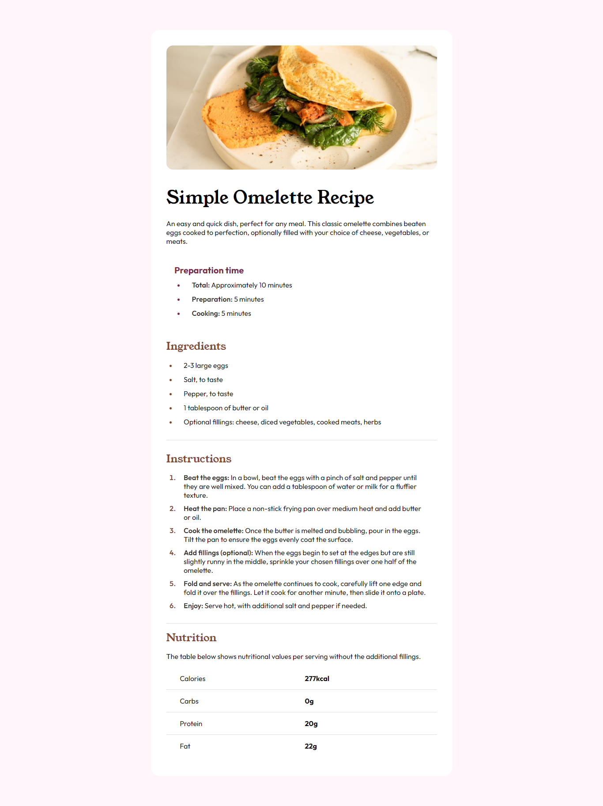

# Frontend Mentor - Recipe page solution

This is a solution to the [Recipe page challenge on Frontend Mentor](https://www.frontendmentor.io/challenges/recipe-page-KiTsR8QQKm). Frontend Mentor challenges help you improve your coding skills by building realistic projects. 

## Table of contents

- [Overview](#overview)
  - [Screenshot](#screenshot)
  - [Links](#links)
- [My process](#my-process)
  - [Built with](#built-with)
  - [What I learned](#what-i-learned)
  - [Continued development](#continued-development)
  - [Useful resources](#useful-resources)
- [Author](#author)

## Overview

### Screenshot



### Links

- Solution URL: [Add solution URL here](https://your-solution-url.com)
- Live Site URL: [Add live site URL here](https://your-live-site-url.com)

## My process

### Built with

- Semantic HTML5 markup
- CSS custom properties

### What I learned

- **Reinforcement of HTML and CSS Skills:** Building this project reinforced my existing knowledge of HTML and CSS, providing valuable hands-on experience.

- **Exploration of CSS Features:** During the project, I explored various CSS features in-depth, expanding my understanding of its capabilities and learning new techniques.

- **Styling Tables:** A key takeaway was mastering the art of styling tables effectively, which significantly enhanced the presentation of tabular data within the project.

- **Utilizing Pseudo-classes and Pseudo-elements:**  I honed my skills in utilizing pseudo-classes and pseudo-elements to achieve specific styling effects, contributing to the project's design and functionality.
  
Code overview, see below:

```html
<main>
        <section class="preperations">
            <div class="img_container">
            
            </div>
            
            <div class="recipe_heading">
            <h1 id="main_heading">Simple Omelette Recipe</h1>
                <p>An easy and quick dish, perfect for any meal. This classic omelette combines beaten eggs cooked to perfection, optionally filled with your choice of cheese, vegetables, or meats.</p>
            </div>
            
            <div class="prep_time">
                <div class="prep_time_heading">      
                    <h4>Preparation time</h4>
                </div>
                <ul class="prep_total_time">
                    <li><span>Total:</span> Approximately 10 minutes</li>
                    <li><span>Preparation:</span> 5 minutes</li>
                    <li><span>Cooking:</span> 5 minutes</li>
                </ul>
            </div>
            
            <div class="ingredients">
                <div class="ingredients_heading">
                    <h2 class="heading">Ingredients</h2>
                </div>
                
                <div class="ingredients_content">
                    <ul>
                        <li>2-3 large eggs</li>
                        <li>Salt, to taste</li>
                        <li>Pepper, to taste</li>
                        <li>1 tablespoon of butter or oil</li>
                        <li>Optional fillings: cheese, diced vegetables, cooked meats, herbs</li>
                    </ul>
                </div>
            </div>
        </section>
        
    <section class="instructions">
        <div class="instructions_heading">
            <h2 class="heading">Instructions</h2>
        </div>
        <div class="instructions_content">
            <ol>
                <li>
                    <span>
                        Beat the eggs:
                    </span>
                    In a bowl, beat the eggs with a pinch of salt and pepper until they are well mixed. 
You can add a tablespoon of water or milk for a fluffier texture.</li>

                <li>
                <span>
                    Heat the pan:
                </span>
                    Place a non-stick frying pan over medium heat and add butter or oil.</li>
                <li>
                    <span>
                        Cook the omelette:
                    </span>
                    Once the butter is melted and bubbling, pour in the eggs. Tilt the pan to ensure the eggs evenly coat the surface.</li>
                <li>
                    <span>
                        Add fillings (optional):
                    </span>
                    When the eggs begin to set at the edges but are still slightly runny in the 
middle, sprinkle your chosen fillings over one half of the omelette.</li>
                <li>
                    <span>
                        Fold and serve:
                    </span>
                    As the omelette continues to cook, carefully lift one edge and fold it over the fillings. Let it cook for another minute, then slide it onto a plate.</li>
                <li>
                    <span>
                        Enjoy:
                    </span>
                    Serve hot, with additional salt and pepper if needed.
                </li>
            </ol>
        </div>
        <div class="nutrition_content">
            <div class="nutrition_heading">
            <h2 class="heading">Nutrition</h2>
            <p>The table below shows nutritional values per serving without the additional fillings.</p>
        </div>
            <div class="nutrition_table">
                <table>
                    <tbody>
                        <tr>
                            <th>Calories</th>
                            <td>277kcal</td>
                        </tr>
                        <tr>
                            <th>Carbs</th>
                            <td>0g</td>
                        </tr>
                        <tr>
                            <th>Protein</th>
                            <td>20g</td>
                        </tr>
                        <tr>
                            <th>Fat</th>
                            <td>22g</td>
                        </tr>
                    </tbody>
                </table>
            </div>
        </div>
    </section>
    </main>
```
```css
.ingredients_content li::marker , .instructions_content li::marker{
    color: var(--nutmeg-color);
    font-weight: 600;
}

tr:nth-child(-n+3){
    border-bottom: 1px solid var(--lightgrey-color);    
}

```

### Continued development

- In future projects, my focus will be on strengthening my CSS skills, particularly in terms of responsiveness using media queries, refining design through more strategic use of padding and margins, gaining a deeper understanding of pseudo-elements and classes, and mastering advanced positioning techniques. This ongoing learning journey aims to enhance my ability to create visually appealing and user-friendly web experiences while ensuring they adapt seamlessly across various devices and screen sizes.

### Useful resources

- [MDN web docs](https://developer.mozilla.org/en-US/docs/Web/CSS) - Leveraging MDN as a reference not only provides clarity on various pseudo-elements and classes but also ensures correct syntax in implementing media queries, enhancing the project's consistency and compatibility across different platforms.
- [w3schools](https://www.w3schools.com) - Utilizing W3Schools for real-time practice facilitates the application of newfound knowledge, enabling visual understanding and reinforcing learning outcomes effectively.

## Author
- Frontend Mentor - [@Boneless_egg](https://www.frontendmentor.io/profile/itsjavascript)

